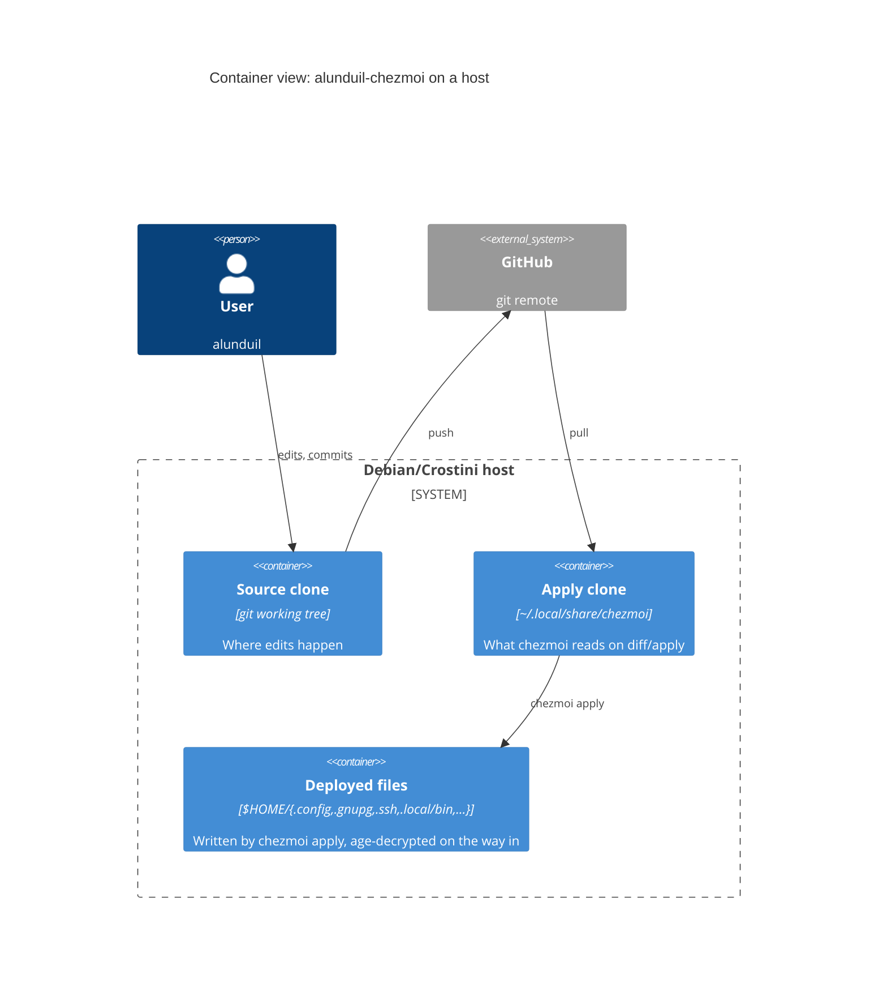

# Architecture

Background and rationale for this repo's design. For step-by-step setup, see [tutorials/bootstrap.md](../tutorials/bootstrap.md). For task-shaped how-tos, see [how-to/](../how-to/).

## At a glance

[C4](https://c4model.com) Container view, steady state—the prose below covers bootstrap-only edges (password-manager → age key).

## Source vs. apply clone

chezmoi separates the *source* (this checkout) from the *applied clone* at `~/.local/share/chezmoi`. `chezmoi diff` and `chezmoi apply` read the apply clone, not the working tree, so edits here only take effect after you commit them and update the apply clone. Use `chezmoi diff --source-path .` to preview from this checkout.

The split exists so a half-finished edit in the dev clone can't corrupt a live `chezmoi apply`. The cost—commit + pull before changes go live—buys an always-coherent apply path.

## Ordered idempotent bootstrap

Bootstrap lives in `.chezmoiscripts/`: `run_*_before_*.sh.tmpl` install and configure passes (run before chezmoi applies files) plus `run_onchange_after_*.sh.tmpl` service-enablement and MCP-registration passes (run after). Each script is responsible for one logical concern (system packages, language toolchains, third-party binaries, login-required tools, automatic security updates, etc.) and is safe to re-run.

- **Idempotent** two ways. Most install passes are `run_once_before`: chezmoi runs each unique content once, never again. Passes that must re-fire when their *inputs* change are `run_onchange_before`: `_02` hashes the pinned `script/install/*` versions, `_04` the `etc/apt/*` config, so an upstream bump re-runs them. Either way, scripts tolerate "already installed" without bailing.
- **Ordered where order is load-bearing.** The `before` passes carry a two-digit prefix because some installs depend on others (ghcup must exist before `cabal` can build); it's a stable sort key, not a reservation system—gaps are fine. The `after` passes are mutually independent, so they drop the number and name the concept. Filename is chezmoi's only ordering lever, so numbers earn their place only where a real dependency exists.
- **One concern per script** so a failed run names its own scope. Scripts map to a product family, not an install mechanism: a tool needing both `apt` and a binary download lives in one script, not split across passes.

Tool versions live in `script/install/*` (one script per tool, each pinning its own `*_VERSION`), and both bootstrap and CI reuse them, so there's exactly one place to bump. Zellij *plugins* (`zellaude`, `zjstatus`) pin via alias tags in `dot_config/zellij/config.kdl`, since the plugin registry is independent of the binary.

## Host roles

One repo, more than one kind of host. The workstation is a Debian/Crostini box that wants the full toolchain; a lean host—the Home Assistant "Advanced SSH & Web Terminal" add-on (Alpine/musl, ephemeral `/root`)—wants only enough to run a Claude session. The `role` data variable is the host-class axis. It defaults to `workstation`, so existing hosts and a plain `chezmoi init` are unchanged; each host otherwise sets it at bootstrap via `CHEZMOI_ROLE`, which the HA add-on passes through its `init_commands`.

Explicit, not detected. Detection would couple intent to incidental signals—OS id, hostname, filesystem markers—that grow brittle as profiles multiply. Setting the value where the host is bootstrapped scales to any number of profiles: a new role is a new value plus ignore rules, never new detection code.

`role` gates sources through `.chezmoiignore`, itself a template. `workstation` drops nothing and renders as before. A lean role names the workstation-only sources to exclude—the Debian/systemd bootstrap, service configs, the age-backed signing and SSH secrets, and the GPG-signing `gitconfig`, which would fail every commit on a host with no signing key. It has to be a denylist: chezmoi's un-ignore (`!`) overrides *every* ignore, so an allowlist (`*` then `!keep`) would pull the repo-wide `.bats`/`_test.py` excludes back into the applied tree. A denylist composes with those excludes instead, and a role that needs one source back re-includes that specific file with `!`.

The exclusions also shrink the secret blast radius: a network-exposed, ephemeral host next to home automation carries only the narrowly scoped tokens it needs, never the long-lived signing and SSH identities the workstation holds.

## Layered trust: Everything behind age

The source tree stores long-lived secrets as age-encrypted blobs that unlock at `apply` time:

- **age key** lives at `~/.config/chezmoi/key.txt`, and a password manager restores it on a fresh host. It's the one out-of-band secret the bootstrap needs: `chezmoi init` renders `.chezmoi.toml.tmpl` into `~/.config/chezmoi/chezmoi.toml` to point chezmoi at age and its recipient, so pasting the key is the only manual step. That recipient is a public key, not a second secret.
- **GPG** signs commits. The secret key ships as an age-encrypted blob in `private_dot_gnupg/`; trust chain is *age key + GPG passphrase*.
- **SSH** keys (`~/.ssh/{id_rsa,config}`) ship the same way under `private_dot_ssh/`; trust chain is just the age key. This is what makes `chezmoi init --apply` over HTTPS bootstrap straight into a working SSH-to-GitHub state.

Age secures secrets at rest but can't itself sign commits or authenticate to SSH; putting GPG and SSH behind the same age-key recovery flow means a fresh host needs exactly one out-of-band secret to bootstrap the rest. The paper-key backup (see [how-to/pgp-signing.md](../how-to/pgp-signing.md)) is the independent fallback if you lose both clouds and the repo together.

## `gh` shim

`dot_local/bin/executable_gh` shadows system `gh` to enforce `--draft` on `gh pr create`. The shim exists because Claude Code opens PRs through `gh`, and the project rule is "every PR opens as draft, human promotes to ready." Enforcing this in a wrapper rather than via memory keeps the rule load-bearing even when memory slips. `GH_DRAFT_GUARD=off` overrides for the rare manual case.

`gh` extensions install in `.chezmoiscripts/run_once_before_05-*` alongside other bespoke installers, not script 02—they're managed by `gh extension`, not the `script/install/` download-and-verify pattern, so they don't fit that script's shape. Version pin lives inline (for example, `GH_POI_VERSION`).

## Two `CLAUDE.md` files

Two files, two audiences:

- `CLAUDE.md` (this repo's root) loads into Claude's context every relevant turn when editing the chezmoi *source*. It's optimised for tokens, not readability—terse rules, no decorative prose.
- `dot_claude/CLAUDE.md` deploys to `~/.claude/CLAUDE.md` on apply, and Claude loads it into context for *every* project on this host. Cross-cutting defaults live there.

Editing the deployed file directly would lose the change on the next `chezmoi apply`, so the source-of-truth is always the chezmoi-managed copy. This document, by contrast, targets human contributors and can be longer and more discursive.
