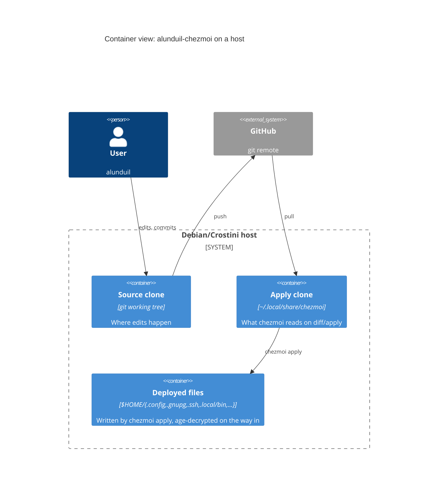

# Architecture

Background and rationale for this repo's design. For step-by-step setup, see [tutorials/bootstrap.md](../tutorials/bootstrap.md). For task-shaped how-tos, see [how-to/](../how-to/).

## At a glance

[C4](https://c4model.com) Container view, steady state—the prose below covers bootstrap-only edges (password-manager → age key).

## Source vs. apply clone

chezmoi separates the *source* (this checkout) from the *applied clone* at `~/.local/share/chezmoi`. `chezmoi diff` and `chezmoi apply` read the apply clone, not the working tree, so edits here only take effect after you commit them and update the apply clone. Use `chezmoi diff --source-path .` to preview from this checkout.

The split exists so a half-finished edit in the dev clone can't corrupt a live `chezmoi apply` mid-keystroke. The cost is one extra step (commit + pull) before changes go live, which is small in exchange for an always-coherent apply path.

## Ordered idempotent bootstrap

Bootstrap lives in `.chezmoiscripts/`: `run_*_before_*.sh.tmpl` install and configure passes (run before chezmoi applies files) plus `run_onchange_after_*.sh.tmpl` service-enablement and MCP-registration passes (run after). Each script is responsible for one logical concern (system packages, language toolchains, third-party binaries, login-required tools, automatic security updates, etc.) and is safe to re-run.

- **Idempotent** two ways. Most install passes are `run_once_before`: chezmoi runs each unique content once and never again. The passes that must re-fire when their *inputs* change are `run_onchange_before` instead: `run_onchange_before_02` tracks the pinned `script/install/*` versions and `run_onchange_before_04` the `etc/apt/*` config, and both embed those inputs' hashes so an upstream bump re-runs them. Either way, scripts tolerate "already installed" without bailing.
- **Ordered where order is load-bearing.** The `before` passes carry a two-digit prefix because some installs depend on others (for example, ghcup must exist before `cabal` can build anything); the prefix is a stable sort key, not a reservation system—gaps are fine. The `after` passes (`run_onchange_after_register-*-mcp`, `run_onchange_after_enable-*`) are mutually independent, so they drop the number and name the concept—chezmoi's only ordering lever is the filename, so numbers earn their place only where a real dependency exists.
- **One concern per script** so a failed run names its own scope. Scripts map to a product family, not an install mechanism—a tool that needs both `apt` and a binary download lives together, not split across the apt and download passes.

Tool versions live in `script/install/*` (one script per tool, each pinning its own `*_VERSION`), and both bootstrap and CI reuse them, so there's exactly one place to bump. Zellij *plugins* (`zellaude`, `zjstatus`) pin via alias tags in `dot_config/zellij/config.kdl`, since the plugin registry is independent of the binary.

## Layered trust: Everything behind age

The source tree stores long-lived secrets as age-encrypted blobs that unlock at `apply` time:

- **age key** lives at `~/.config/chezmoi/key.txt`, and a password manager restores it on a fresh host. It's the one out-of-band secret the bootstrap needs: `chezmoi init` renders `.chezmoi.toml.tmpl` into `~/.config/chezmoi/chezmoi.toml` to point chezmoi at age and its recipient, so pasting the key is the only manual step. That recipient is a public key, not a second secret.
- **GPG** signs commits. The secret key ships as an age-encrypted blob in `private_dot_gnupg/`; trust chain is *age key + GPG passphrase*.
- **SSH** keys (`~/.ssh/{id_rsa,config}`) ship the same way under `private_dot_ssh/`; trust chain is just the age key. This is what makes `chezmoi init --apply` over HTTPS bootstrap straight into a working SSH-to-GitHub state.

Age handles "secrets at rest in a public-ish git repo" cleanly but can't sign commits or authenticate to SSH servers. GPG and SSH each need somewhere safe to live. Putting both behind the same age-key recovery flow means a fresh host needs exactly one out-of-band secret to bootstrap everything else. The paper-key backup (see [how-to/pgp-signing.md](../how-to/pgp-signing.md)) is the independent fallback if you lose both clouds and repo together.

## `gh` shim

`dot_local/bin/executable_gh` shadows system `gh` to enforce `--draft` on `gh pr create`. The shim exists because Claude Code opens PRs through `gh`, and the project rule is "every PR opens as draft, human promotes to ready." Enforcing this in a wrapper rather than via memory keeps the rule load-bearing even when memory slips. `GH_DRAFT_GUARD=off` overrides for the rare manual case.

`gh` extensions install in `.chezmoiscripts/run_once_before_05-*` alongside other bespoke installers, not script 02—they're managed by `gh extension`, not the `script/install/` download-and-verify pattern, so they don't fit that script's shape. Version pin lives inline (for example, `GH_POI_VERSION`).

## Two `CLAUDE.md` files

Two files, two audiences:

- `CLAUDE.md` (this repo's root) loads into Claude's context every relevant turn when editing the chezmoi *source*. It's optimised for tokens, not readability—terse rules, no decorative prose.
- `dot_claude/CLAUDE.md` deploys to `~/.claude/CLAUDE.md` on apply, and Claude loads it into context for *every* project on this host. Cross-cutting defaults live there.

Editing the deployed file directly would lose the change on the next `chezmoi apply`, so the source-of-truth is always the chezmoi-managed copy. This document, by contrast, targets human contributors and can be longer and more discursive.
