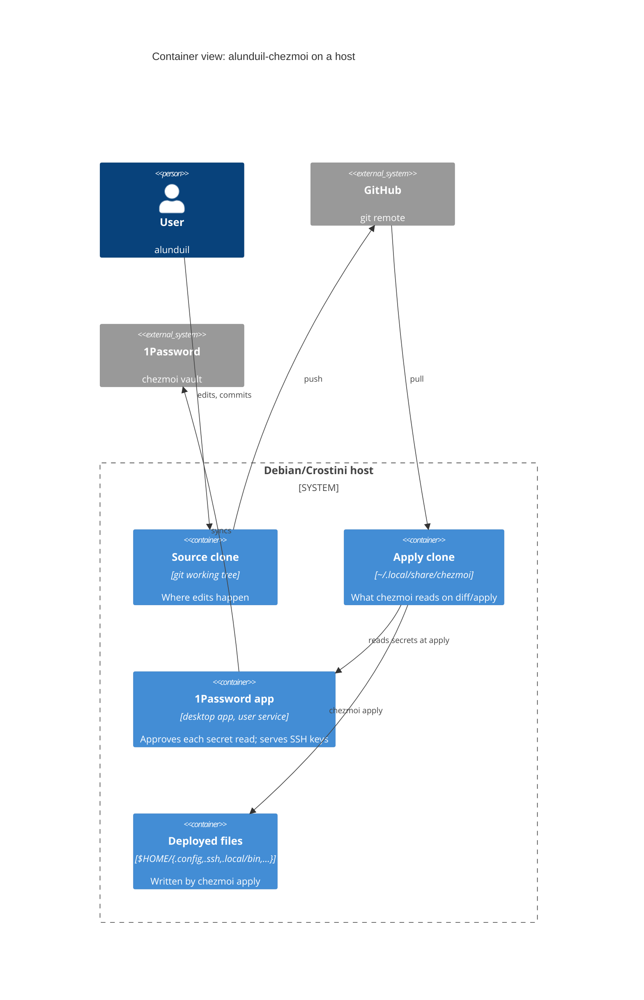

# Architecture

How a change travels from an edit in this repo to a configured host, and
why each stage has the shape it does. For setup, see
[tutorials/bootstrap.md](../tutorials/bootstrap.md). For the rules each
stage follows, see
[reference/bootstrap-reference.md](../reference/bootstrap-reference.md).

```mermaid
C4Container
    title Container view: alunduil-chezmoi on a host

    Person(user, "User", "alunduil")
    System_Ext(github, "GitHub", "git remote")
    System_Ext(vault, "1Password", "chezmoi vault")

    System_Boundary(host, "Debian/Crostini host") {
        Container(source, "Source clone", "git working tree", "Where edits happen")
        Container(apply, "Apply clone", "~/.local/share/chezmoi", "What chezmoi reads on diff/apply")
        Container(app, "1Password app", "desktop app, user service", "Approves each secret read; serves SSH keys")
        Container(home, "Deployed files", "$HOME/{.config,.ssh,.local/bin,...}", "Written by chezmoi apply")
    }

    Rel(user, source, "edits, commits")
    Rel(source, github, "push")
    Rel(github, apply, "pull")
    Rel(apply, home, "chezmoi apply")
    Rel(apply, app, "reads secrets at apply")
    Rel(app, vault, "syncs")
```

## Two clones

An edit doesn't reach the host until it's committed, pushed, and pulled
into the apply clone, because `chezmoi apply` reads only the apply
clone. The detour costs a commit and a pull, and keeps a half-finished
edit from reaching a live apply.

## Apply converges the host

`chezmoi apply` does two jobs: it writes files into `$HOME`, and it runs
bootstrap passes that install and configure what those files expect.
Both converge on a target state: apply offers to restore a file that
drifted, and a pass installs a removed package again or rewrites a
hand-edited file under `/etc`.

Passes run on every apply so they can see drift. [chezmoi's
package-install
guide](https://www.chezmoi.io/user-guide/advanced/install-packages-declaratively/)
recommends `run_onchange_`, but a trigger keyed on script content never
fires when only the host changed.

Convergence makes apply the one operation for both a fresh host and a
drifted one. Bootstrap is the first apply, and every later apply
repairs whatever changed since. Release binaries follow the same rule:
they're chezmoi externals, ordinary targets that come back when deleted
([ADR 0008](../adr/0008-install-pinned-binaries-as-chezmoi-externals.md)).

## Host roles

One repo configures more than one kind of host. The workstation wants
the full toolchain. The Home Assistant SSH add-on, an ephemeral Alpine
container, wants only enough to run a Claude session. The `role` value
picks between them, and `.chezmoiignore` drops what a role doesn't get.

Each host states its role when it bootstraps rather than chezmoi
guessing it. Detection would tie intent to incidental signals such as
the OS, the hostname, or a marker file, and those grow brittle as hosts
multiply. An explicit value scales: a new role is a new value and a
list of exclusions, with no detection code.

Exclusion also limits what a host can leak. The add-on sits on the
network next to home automation, so it receives none of the secrets:
no SSH key, no tokens.

## Secrets live in the vault

Apart from one age-encrypted Cloudflare token, the repo holds no
secrets. It names items in the `chezmoi` 1Password vault, and apply
reads them through the 1Password desktop app on the way into `$HOME`.
The repo is public, so a rotation leaves nothing behind in its history.

Rotation is an edit in the vault followed by an apply. Scripts that
hand a secret to a long-running consumer, such as Alloy, key on a hash
of its value. The apply after a rotation reruns them.

The desktop app is the trust boundary on the host. It approves each
process that reads a secret, so a new process gets a new prompt even
while the app stays unlocked. SSH keys never reach disk: the app signs
with them for both SSH sessions and git commits. `agent.toml` limits the
agent to the key in the vault.
On Crostini nothing else would keep the app alive, so a user service
runs it without a window.

A locked 1Password makes apply fail rather than write an empty
secret. The one way to skip secrets is to set `CHEZMOI_NO_1PASSWORD`,
which the checks and the first bootstrap pass do on purpose. An opt-out
nobody sets by accident is safer than a default that degrades without
notice.

Recovery rests on the 1Password Emergency Kit
([`how-to/recover-access.md`](../how-to/recover-access.md)).

## Beyond this host

Every stage here happens on a host that runs `chezmoi apply`. A Claude
Code session on the web or in a cloud routine starts from a fresh clone
of one repo and receives none of it.
[ADR 0005](../adr/0005-treat-the-checkout-as-the-only-portable-context.md)
records what such a session loads and why the split stays.
