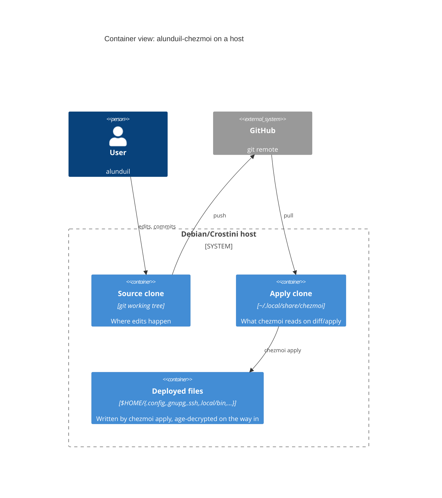

# Architecture

How a change travels from an edit in this repo to a configured host, and
why each stage has the shape it does. For setup, see
[tutorials/bootstrap.md](../tutorials/bootstrap.md). For the rules each
stage follows, see
[reference/bootstrap-reference.md](../reference/bootstrap-reference.md).

```mermaid
C4Container
    title Container view: alunduil-chezmoi on a host

    Person(user, "User", "alunduil")
    System_Ext(github, "GitHub", "git remote")

    System_Boundary(host, "Debian/Crostini host") {
        Container(source, "Source clone", "git working tree", "Where edits happen")
        Container(apply, "Apply clone", "~/.local/share/chezmoi", "What chezmoi reads on diff/apply")
        Container(home, "Deployed files", "$HOME/{.config,.gnupg,.ssh,.local/bin,...}", "Written by chezmoi apply, age-decrypted on the way in")
    }

    Rel(user, source, "edits, commits")
    Rel(source, github, "push")
    Rel(github, apply, "pull")
    Rel(apply, home, "chezmoi apply")
```

## Two clones

An edit doesn't reach the host until it's committed, pushed, and pulled
into the apply clone, because `chezmoi apply` reads only the apply
clone. The detour keeps a half-finished edit in the source clone from
reaching a live apply. Every apply sees a coherent commit, at the cost
of a commit and a pull before a change goes live.

## Apply converges the host

`chezmoi apply` does two jobs: it writes files into `$HOME`, and it runs
bootstrap passes that install and configure what those files expect.
Both converge on a target state rather than replaying steps. Apply
offers to restore a file that drifted. A pass runs on every apply,
checks the host first, and acts only on a difference. A removed package or a
hand-edited file under `/etc` heals on the next apply.
[ADR 0009](../adr/0009-converge-bootstrap-passes-on-every-apply.md)
records why passes converge rather than run once.

Convergence makes apply the one operation for both a fresh host and a
drifted one. Bootstrap is the first apply, and every later apply
repairs whatever changed since. Release
binaries follow the same rule: they're chezmoi externals, ordinary
targets that come back when deleted
([ADR 0008](../adr/0008-install-pinned-binaries-as-chezmoi-externals.md)).

## Host roles

One repo configures more than one kind of host. The workstation wants
the full toolchain. The Home Assistant SSH add-on, an ephemeral Alpine
container, wants only enough to run a Claude session. The `role` value
picks between them, and `.chezmoiignore` drops what a role doesn't get.

Each host states its role when it bootstraps rather than chezmoi
guessing it. Detection would tie intent to incidental signals such as
the OS, the hostname, or a marker file, and those grow brittle as hosts
multiply. An explicit value scales: a new role is a new value and a
list of exclusions, with no detection code.

Exclusion also limits what a host can leak. The add-on sits on the
network next to home automation, so it receives none of the encrypted
sources: no signing key, no SSH identity, no tokens.

## One secret to recover

Long-lived secrets live in the repo as age-encrypted blobs, and apply
decrypts them on the way into `$HOME`. The GPG signing key, the SSH key,
and the service tokens all sit behind the same age key. A fresh host
therefore needs exactly one secret from outside the repo, restored from
a password manager, and bootstrap recovers the rest. With the SSH key
among them, `chezmoi init --apply` over HTTPS ends with SSH to GitHub
working.

Age protects secrets at rest but can't sign a commit or authenticate
SSH, so GPG and SSH still do those jobs. The GPG key adds its own
passphrase, and its paper-key backup
([how-to/pgp-signing.md](../how-to/pgp-signing.md)) recovers it if you
lose the age key and the repo together.

## Beyond this host

Every stage here happens on a host that runs `chezmoi apply`. A Claude
Code session on the web or in a cloud routine starts from a fresh clone
of one repo and receives none of it.
[ADR 0005](../adr/0005-treat-the-checkout-as-the-only-portable-context.md)
records what such a session loads and why the split stays.
