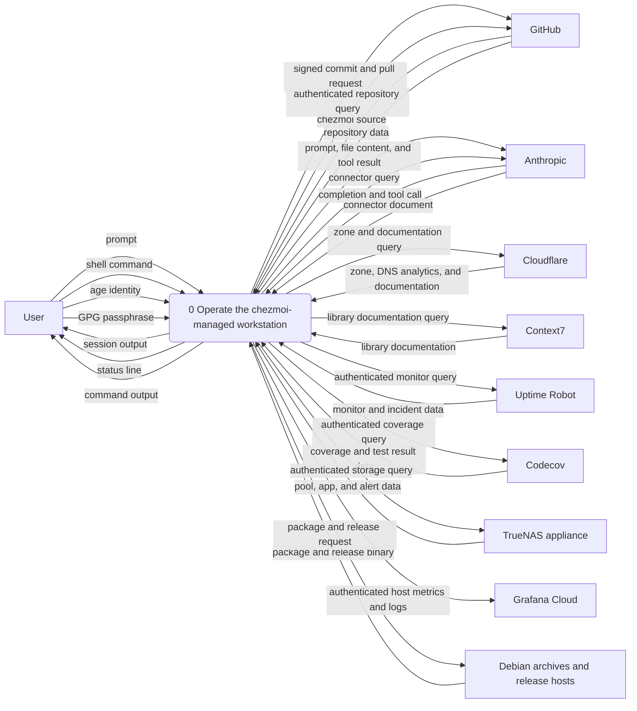
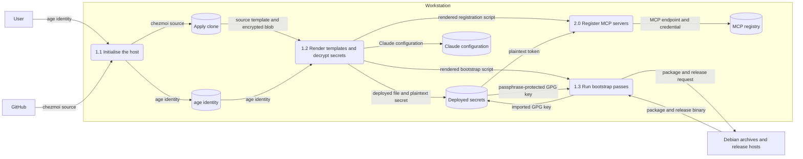
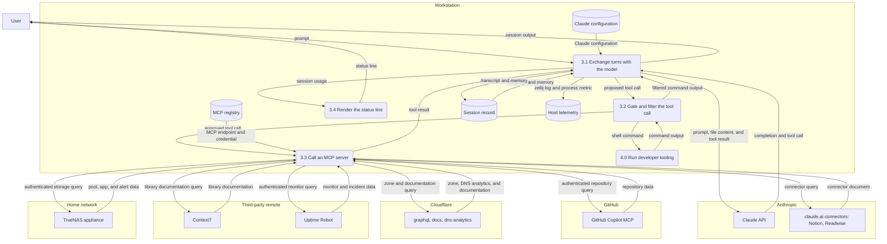

# Data flow

Where data moves on a chezmoi-managed workstation, what transforms it, and which trust boundaries it crosses. The audience is someone threat-modelling this host or auditing a credential: the diagrams below are the input a per-element STRIDE pass walks over, and the secrets table answers "what reaches what" for any one token.

Scope is the workstation-bounded slice of alunduil's personal systems—the surface chezmoi manages, plus the Model Context Protocol (MCP) fleet a Claude Code session talks to. The cloud and home-network slice has its own diagram in `alunduil-infrastructure`, which owns the decomposition of GitHub, Cloudflare, and the home network; here they stay external entities. Controls and mitigations belong to the threat model, not here—a data flow diagram carries boundaries, not defences.

These are *physical* diagrams: elements name the software, hosts, and files doing the work rather than abstract activities. Processes are rounded, data stores are cylinders, external entities are rectangles, and each trust boundary is a `subgraph` named for whoever controls that side. The `dfd` skill under `dot_claude/skills/dfd/` carries the notation and the correctness rules the diagrams are checked against.

## Context

The workstation as a single process, surrounded by everything it exchanges data with. The user is the trust root and sits outside every boundary; every other entity belongs to someone else.

The age identity is the only inbound secret with no network path: a password manager holds it and the user restores it by hand on a fresh host. Everything else the host needs unlocks from that one value.

## The workstation and its stores

Process `0` opens into five: getting the source onto the host and decrypted, turning decrypted tokens into MCP registrations, running a session, running everything the session and the user shell out to, and shipping telemetry off the box.

```mermaid
flowchart TB
  user[User]

  subgraph ws["Workstation: Crostini VM"]
    p1(1.0 Apply the chezmoi source)
    p2(2.0 Register MCP servers)
    p3(3.0 Run a Claude Code session)
    p4(4.0 Run developer tooling)
    p5(5.0 Ship host telemetry)

    s1[(Apply clone)]
    s2[(age identity)]
    s3[(Deployed secrets)]
    s4[(MCP registry)]
    s5[(Claude configuration)]
    s6[(Session record)]
    s7[(Host telemetry)]
  end

  subgraph gh[GitHub]
    github[GitHub API and git remote]
  end

  subgraph anth[Anthropic]
    anthropic[Claude API and claude.ai connectors]
  end

  subgraph cf[Cloudflare]
    cloudflare[Cloudflare MCP endpoints]
  end

  subgraph tp[Third-party SaaS]
    context7[Context7]
    uptimerobot[Uptime Robot]
    codecov[Codecov]
    grafana[Grafana Cloud]
  end

  subgraph home[Home network]
    truenas[TrueNAS appliance]
  end

  subgraph dist[Distribution and release hosts]
    upstream[Debian archives and release hosts]
  end

  user -->|age identity| p1
  user -->|prompt| p3
  user -->|shell command| p4
  user -->|GPG passphrase| p4
  p3 -->|session output| user
  p3 -->|status line| user
  p4 -->|command output| user

  github -->|chezmoi source| p1
  p1 -->|chezmoi source| s1
  s1 -->|source template and encrypted blob| p1
  p1 -->|age identity| s2
  s2 -->|age identity| p1
  p1 -->|deployed file and plaintext secret| s3
  p1 -->|Claude configuration| s5
  s3 -->|passphrase-protected GPG key| p1
  p1 -->|imported GPG key| s3
  p1 -->|rendered registration script| p2
  p1 -->|package and release request| upstream
  upstream -->|package and release binary| p1

  s3 -->|plaintext token| p2
  p2 -->|MCP endpoint and credential| s4

  s4 -->|MCP endpoint and credential| p3
  s5 -->|Claude configuration| p3
  s6 -->|transcript and memory| p3
  p3 -->|transcript and memory| s6
  p3 -->|shell command| p4
  p4 -->|command output| p3
  p3 -->|zellij log and process metric| s7

  anthropic -->|completion and tool call| p3
  anthropic -->|connector document| p3
  p3 -->|prompt, file content, and tool result| anthropic
  p3 -->|connector query| anthropic
  cloudflare -->|zone, DNS analytics, and documentation| p3
  p3 -->|zone and documentation query| cloudflare
  context7 -->|library documentation| p3
  p3 -->|library documentation query| context7
  uptimerobot -->|monitor and incident data| p3
  p3 -->|authenticated monitor query| uptimerobot
  truenas -->|pool, app, and alert data| p3
  p3 -->|authenticated storage query| truenas
  github -->|repository data| p3
  p3 -->|authenticated repository query| github

  s3 -->|plaintext token and signing key| p4
  github -->|repository data| p4
  p4 -->|authenticated repository query| github
  p4 -->|signed commit and pull request| github
  codecov -->|coverage and test result data| p4
  p4 -->|authenticated coverage query| codecov

  s3 -->|Grafana Cloud token| p5
  s7 -->|journal entry, zellij log, and process metric| p5
  p5 -->|authenticated host metrics and logs| grafana
```

Two stores hold plaintext credentials and neither is a chezmoi target. *Deployed secrets* is the union of `~/.config/*/`, `~/.ssh/`, and `~/.gnupg/`, written on apply with the encryption stripped off; the source tree only ever holds the age-encrypted blob. *MCP registry* is `~/.claude.json`, which Claude Code owns and rewrites: registration happens through a bootstrap pass rather than a deployed config file because chezmoi can't manage a file another program writes to. Bearer tokens and stdio environment variables land there in plaintext, which is why a rotated token has to re-register rather than merely re-deploy.

*Session record* covers transcripts and the per-project auto memory under `~/.claude/projects/`. It's machine-local with no cross-machine path in either direction, so it never crosses a boundary except as prompt content the model already sees.

The lean host role narrows this picture rather than adding to it. `.chezmoiignore` drops the age-backed signing and SSH sources for that role, so a network-exposed host next to home automation carries only the narrowly scoped tokens it needs.

## Applying the source

Process `1.0` is where the single out-of-band secret turns into every other one.

The apply clone at `~/.local/share/chezmoi` is the store `1.2` reads, not this working tree—an edit here has no effect until it's committed and pulled. That separation exists so a half-finished edit can't corrupt a live apply, and it means the diagram's `chezmoi source` flow always originates at GitHub rather than at the developer's checkout.

The GPG key crosses `1.3` still encrypted. The armored blob is passphrase-protected by GPG independently of age, so the trust chain for signing is age identity *and* GPG passphrase, while SSH needs only the age identity. That asymmetry is deliberate: SSH-to-GitHub has to work unattended for `chezmoi init --apply` to bootstrap a host in one command, whereas signing already has a human at the keyboard.

## The session and the MCP fleet

Process `3.0` opens into the turn loop, the hooks that sit between the model and the host, the MCP dispatcher, and the status line. This is the level where the fleet's trust boundaries separate.

Process `3.2` is this repo's own gate between a model-proposed action and the host, layered over Claude Code's permission prompts rather than replacing them, and it carries three jobs. The pull-request guard rejects a `create_pull_request` call missing `draft: true`. The pre-commit guard runs lint on a just-edited file so failures surface in the same turn. The `rtk` proxy rewrites Bash commands and trims their output, which is why `command output` re-enters `3.1` as *filtered* command output—what `3.1` sees is a summary of what the host said, not the host's own answer.

Four kinds of credential relationship show up across the fleet, and the difference matters more than the vendor does:

- **No local credential.** The claude.ai connectors authenticate by an OAuth grant held on the Anthropic account. Nothing for Notion or Readwise is deployed to this host, so a compromised workstation reaches them only for as long as it can drive a session.
- **OAuth held by Claude Code.** The Cloudflare endpoints are Cloudflare-hosted and obtain their grant through a browser on first use. The grant lives outside the chezmoi source, so rotating it isn't an apply-time operation.
- **Bearer token in the registry.** GitHub and Uptime Robot pass a token via `--header`, which Claude Code writes into `~/.claude.json` in plaintext. GitHub takes this route because its OAuth endpoint wants a pre-registered client that Claude Code's dynamic registration doesn't satisfy.
- **Environment variable to a local process.** TrueNAS runs as a stdio binary on this host with its URL and API key passed as `-e` variables, also persisted into `~/.claude.json`. It's the only flow that terminates inside the home network, and it runs with certificate verification disabled because the appliance's certificate carries no IP subject alternative name.

Context7 sits outside all four: it runs keyless by choice. Anonymous use is rate-limited and a key would raise the ceiling, but no limit pressure has appeared, so the cheapest configuration is the one with no secret to leak.

## Deployed secrets

Every credential the source tree carries, and what reaches what once it's decrypted.

| Secret | Deployed to | Read by | Boundary it crosses |
| --- | --- | --- | --- |
| age identity | `~/.config/chezmoi/key.txt` | chezmoi apply | none—never leaves the host |
| GPG secret key | `~/.gnupg/secret-keys.asc` | PGP import pass, commit signing | none directly; signatures reach GitHub |
| SSH key and config | `~/.ssh/` | git over SSH | GitHub |
| GitHub token | `~/.config/github/token` | `github` MCP registration, then `~/.claude.json` | GitHub |
| TrueNAS API key | `~/.config/truenas/api_key` | `truenas` MCP registration, then `~/.claude.json` | home network |
| Uptime Robot token | `~/.config/uptimerobot/token` | `uptimerobot` MCP registration; `UPTIMEROBOT_API_TOKEN` in the shell | Uptime Robot |
| Codecov token | `~/.config/codecov/token` | `CODECOV_API_TOKEN`, consumed by `codecov-api` | Codecov |
| Grafana Cloud token | `~/.config/grafana-cloud/token` | `alloy.service` via `LoadCredential` | Grafana Cloud |
| Cloudflare token | `~/.config/cloudflare/token` | `CLOUDFLARE_API_TOKEN` in the shell | none drawn |

The Cloudflare row is the one the diagram argues about. The token is decrypted and exported into every interactive shell, yet no drawn flow carries it anywhere: the three Cloudflare MCP servers are Cloudflare-hosted and authenticate by OAuth, not by this token. What that establishes is narrower than "unused"—the diagram covers what this repo manages, and ad-hoc shell use leaves no trace in the source tree. It reduces the question to one only the user can answer, which is the most a diagram can do here.

Two other rows are worth reading together. The GitHub token and the SSH key both reach GitHub, but through different processes with different blast radii: the SSH key authenticates git transport and is scoped by the key's own registration, while the token authenticates the MCP server and carries whatever fine-grained permissions were granted at issue time. A single compromise of `~/.claude.json` reaches the second and not the first.

## Currency

A diagram that has drifted from the system is worse than none, because it's trusted. This one is maintained in the same change that adds, removes, or reshapes any element it shows—a new MCP server, a new encrypted secret, a hook that gains or loses a job, a telemetry sink. The repo's `CLAUDE.md` carries that rule where the next editor will read it.
