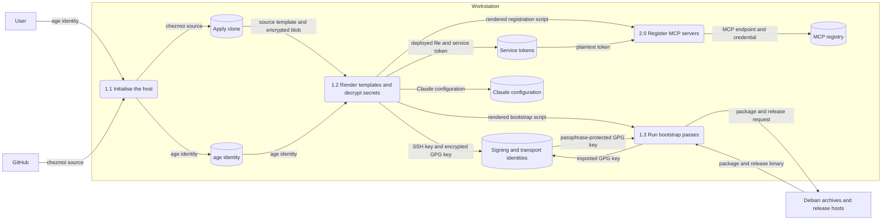
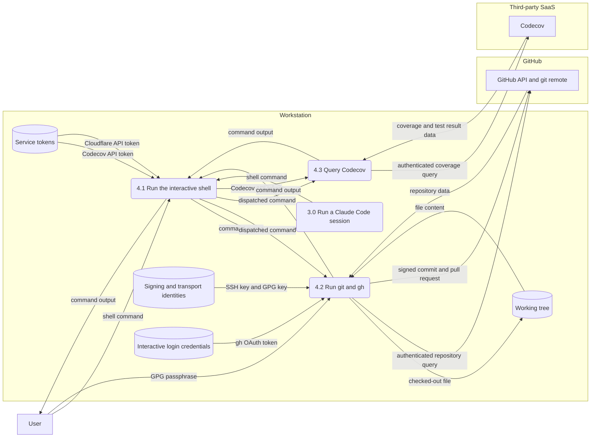

# Data flow

Every credential on a chezmoi-managed workstation, what reaches it, and which trust boundary it crosses. Elements name real software, hosts, and files: the Model Context Protocol (MCP) servers a Claude Code session calls, the systemd timers, the tokens on disk.

Cloud and home-network internals live in `alunduil-infrastructure`. GitHub, Cloudflare, and the home network stay external entities here, and everything that follows from these flows belongs to the threat model. Notation comes from the `dfd` skill under `dot_claude/skills/dfd/`. `CLAUDE.md` carries the rule that keeps this current.

## Context

Eleven parties sit outside the workstation, and the host wants something different from each.

- **User.** The trust root, outside every boundary. Supplies the age identity, the commit-signing passphrase, and all eight interactive logins, so every credential the host holds traces back to a person at a keyboard.
- **Anthropic.** Runs the model each session turn goes through, and fronts the claude.ai connectors, so Notion pages and Readwise highlights arrive across the same boundary. Prompts, file contents, and tool results leave the host here, the least structured outflow it has.
- **GitHub.** Origin of the chezmoi source itself and of every repository worked on here. Takes signed commits over SSH and answers issue and pull request queries over the Copilot server, which is why three processes cross this boundary holding three different credentials.
- **Cloudflare.** Read-only inspection of zones this host doesn't own: name-resolution analytics, GraphQL analytics, and product documentation, each a separate Cloudflare-hosted server. Terraform in `alunduil-infrastructure` owns the records themselves.
- **Context7.** Library and framework documentation current enough to correct a model whose training data lags the release. The one party reached with no credential.
- **Uptime Robot.** Whether the services it watches are still answering, and the incident history for when they weren't.
- **Codecov.** Flaky-test signal, failure history, and per-pull-request coverage, queried over the API because the web interface sits behind a login wall.
- **Grafana Cloud.** Keeps the telemetry that has to outlive the incident it records: node and per-process metrics, the journal, and the Zellij server log. The shipper retains no local copy, because a collector inside the user slice goes dark exactly when that slice exhausts its process pool.
- **TrueNAS appliance.** The home storage appliance: pools and snapshots, the apps it runs, and the alerts it raises. The only exchange terminating inside the home network.
- **Debian archives and release hosts.** Where executable code comes from: seven vendor apt repositories, pinned release binaries, and two installers piped into a shell.
- **tailnet peers.** A private network joining this host to the user's other machines, and the only path in that the host didn't open.

## The workstation and its stores

Nothing inside the workstation boundary is privilege-separated. A bootstrap pass and a model-driven session run as the same user, over the same stores.

```mermaid
flowchart TB
  user[User]

  subgraph ws["Workstation: Crostini VM"]
    p1(1.0 Apply the chezmoi source)
    p2(2.0 Register MCP servers)
    p3(3.0 Run a Claude Code session)
    p4(4.0 Run developer tooling)
    p5(5.0 Ship host telemetry)
    p6(6.0 Authenticate interactively)
    p7(7.0 Run scheduled maintenance)
    p8(8.0 Serve the tailnet)

    s1[(Apply clone)]
    s2[(age identity)]
    s3[(Service tokens)]
    s8[(Signing and transport identities)]
    s4[(MCP registry)]
    s5[(Claude configuration)]
    s6[(Session record)]
    s7[(Host telemetry)]
    s9[(Interactive login credentials)]
    s10[(Working tree)]
  end

  subgraph gh[GitHub]
    github[GitHub API and git remote]
  end

  subgraph anth[Anthropic]
    anthropic[Claude API and claude.ai connectors]
  end

  subgraph cf[Cloudflare]
    cloudflare[Cloudflare MCP endpoints]
  end

  subgraph tp[Third-party SaaS]
    context7[Context7]
    uptimerobot[Uptime Robot]
    codecov[Codecov]
    grafana[Grafana Cloud]
  end

  subgraph home[Home network]
    truenas[TrueNAS appliance]
  end

  subgraph dist[Distribution and release hosts]
    upstream[Debian archives and release hosts]
  end

  subgraph tn[Tailnet]
    tailnet[Tailnet peers]
  end

  user -->|age identity| p1
  user -->|prompt| p3
  user -->|shell command| p4
  user -->|GPG passphrase| p4
  user -->|login credential| p6
  p6 -->|session credential| s9
  p3 -->|session output| user
  p3 -->|status line| user
  p4 -->|command output| user

  github -->|chezmoi source| p1
  p1 -->|chezmoi source| s1
  s1 -->|source template and encrypted blob| p1
  p1 -->|age identity| s2
  s2 -->|age identity| p1
  p1 -->|deployed file and service token| s3
  p1 -->|SSH key and encrypted GPG key| s8
  p1 -->|Claude configuration| s5
  s8 -->|passphrase-protected GPG key| p1
  p1 -->|imported GPG key| s8
  p1 -->|rendered registration script| p2
  p1 -->|package and release request| upstream
  upstream -->|package and release binary| p1

  s3 -->|plaintext token| p2
  p2 -->|MCP endpoint and credential| s4

  s4 -->|MCP endpoint and credential| p3
  s5 -->|Claude configuration| p3
  s6 -->|transcript and memory| p3
  s9 -->|Anthropic session credential| p3
  s10 -->|file content| p3
  p3 -->|edited file| s10
  p3 -->|transcript and memory| s6
  p3 -->|shell command| p4
  p4 -->|command output| p3
  p3 -->|zellij log and process metric| s7

  anthropic -->|completion and tool call| p3
  anthropic -->|connector document| p3
  p3 -->|prompt, file content, and tool result| anthropic
  p3 -->|connector query| anthropic
  cloudflare -->|zone, DNS analytics, and documentation| p3
  p3 -->|zone and documentation query| cloudflare
  context7 -->|library documentation| p3
  p3 -->|library documentation query| context7
  uptimerobot -->|monitor and incident data| p3
  p3 -->|authenticated monitor query| uptimerobot
  truenas -->|pool, app, and alert data| p3
  p3 -->|authenticated storage query| truenas
  github -->|repository data| p3
  p3 -->|authenticated repository query| github

  s3 -->|Codecov API token| p4
  s3 -->|Cloudflare API token| p4
  s8 -->|SSH key and GPG key| p4
  s9 -->|gh OAuth token| p4
  s10 -->|file content| p4
  p4 -->|checked-out file| s10
  github -->|repository data| p4
  p4 -->|authenticated repository query| github
  p4 -->|signed commit and pull request| github
  codecov -->|coverage and test result data| p4
  p4 -->|authenticated coverage query| codecov

  s3 -->|Grafana Cloud token| p5
  s7 -->|journal entry, zellij log, and process metric| p5
  p5 -->|authenticated host metrics and logs| grafana

  s9 -->|gh OAuth token| p7
  s10 -->|file content| p7
  github -->|repository data| p7
  p7 -->|authenticated repository query| github
  p7 -->|pruned branch| s10
  p7 -->|package and release request| upstream
  upstream -->|package and release binary| p7
  p7 -->|process metric| s7

  s9 -->|node key| p8
  tailnet -->|inbound peer connection| p8
  p8 -->|outbound peer connection| tailnet
```

Three stores hold unencrypted credentials. The source tree holds none of them, carrying only the age-encrypted blob. *Service tokens* and *Signing and transport identities* are chezmoi targets, written on apply with the encryption stripped off. Their reach differs: the tokens fan out to three processes and, through the registry, into a file that holds them unencrypted, while a single process reads the identities.

*MCP registry* is `~/.claude.json`, which Claude Code owns and rewrites, so chezmoi can't manage it and registration runs from a bootstrap pass instead. Bearer tokens and stdio environment variables land there unencrypted, and a rotated token has to re-register rather than merely re-deploy.

*Session record* covers transcripts and the per-project auto memory under `~/.claude/projects/`. It's machine-local with no cross-machine path in either direction, so it never crosses a boundary except as prompt content the model already sees.

The lean host role narrows this picture. `.chezmoiignore` drops the whole *Signing and transport identities* store for that role, so a network-exposed host next to home automation carries only the narrowly scoped tokens it needs.

## Applying the source

Process `1.0` is where the single out-of-band secret turns into every other one.

`1.2` reads the apply clone at `~/.local/share/chezmoi`, never a developer's working tree, which is why `chezmoi source` always originates at GitHub. [Architecture](architecture.md) covers why the two clones are separate.

The GNU Privacy Guard (GPG) key crosses `1.3` still encrypted, because the armored blob carries its own passphrase independently of age. Signing therefore needs age identity *and* GPG passphrase. SSH needs only the age identity, and that asymmetry lets `chezmoi init --apply` reach GitHub unattended on a fresh host.

`1.3` is also where executable code enters, from more sources than any other process. The bootstrap adds apt repositories and signing keys for HashiCorp, GitHub CLI, Signal, Keybase, Docker, 1Password, and Adoptium. It downloads VS Code and the pinned binaries under `script/install/`, and pipes two vendor installers, chezmoi's and Tailscale's, into a shell. The pinned downloads check a sha256 published in the same release as the artifact it covers.

## The session and its server fleet

This is the level where the fleet's trust boundaries separate.

```mermaid
flowchart TB
  user[User]

  subgraph ws[Workstation]
    p31(3.1 Exchange turns with the model)
    p32(3.2 Gate the tool call)
    p33(3.3 Annotate the tool result)
    p34(3.4 Call an MCP server)
    p35(3.5 Render the status line)
    p36(3.6 Edit a working tree file)
    p4(4.0 Run developer tooling)

    s4[(MCP registry)]
    s5[(Claude configuration)]
    s6[(Session record)]
    s7[(Host telemetry)]
    s9[(Interactive login credentials)]
    s10[(Working tree)]
  end

  subgraph anth[Anthropic]
    api[Claude API]
    connectors["claude.ai connectors: Notion, Readwise"]
  end

  subgraph gh[GitHub]
    github[GitHub Copilot MCP]
  end

  subgraph cf[Cloudflare]
    cloudflare["graphql, docs, dns-analytics"]
  end

  subgraph tp[Third-party remote]
    context7[Context7]
    uptimerobot[Uptime Robot]
  end

  subgraph home[Home network]
    truenas[TrueNAS appliance]
  end

  user -->|prompt| p31
  s5 -->|Claude configuration| p31
  s6 -->|transcript and memory| p31
  s9 -->|Anthropic session credential| p31
  p31 -->|transcript and memory| s6
  p31 -->|session output| user
  p31 -->|zellij log and process metric| s7
  p31 -->|session usage| p35
  p35 -->|status line| user

  api -->|completion and tool call| p31
  p31 -->|prompt, file content, and tool result| api

  p31 -->|proposed tool call| p32
  p32 -->|shell command| p4
  p32 -->|approved tool call| p34
  p32 -->|approved file edit| p36
  p34 -->|tool result| p33

  s10 -->|file content| p36
  p36 -->|edited file| s10
  p36 -->|tool result| p33

  p4 -->|command output| p33
  p33 -->|annotated tool result| p31

  s4 -->|MCP endpoint and credential| p34
  p34 -->|connector query| connectors
  connectors -->|connector document| p34
  p34 -->|authenticated repository query| github
  github -->|repository data| p34
  p34 -->|zone and documentation query| cloudflare
  cloudflare -->|zone, DNS analytics, and documentation| p34
  p34 -->|library documentation query| context7
  context7 -->|library documentation| p34
  p34 -->|authenticated monitor query| uptimerobot
  uptimerobot -->|monitor and incident data| p34
  p34 -->|authenticated storage query| truenas
  truenas -->|pool, app, and alert data| p34
```

Processes `3.2` and `3.3` sit between a model-proposed action and the host, layered over Claude Code's permission prompts rather than replacing them. They hold different powers at different moments. `3.2` is the `PreToolUse` phase, and the only one that can stop anything. The pull-request guard rejects a `create_pull_request` call missing `draft: true`, and the `rtk` hook rewrites a Bash command to run through a filtering proxy. `3.3` is the `PostToolUse` phase and can only add: lint on a just-written file, and the session events the Zellij pane title reads.

The rewrite in `3.2` is why the `command output` arriving at `3.3` is already trimmed—`4.0` ran the proxy, not the bare command. What `3.1` finally reads is a summary of what the host said, not the host's own answer.

Four kinds of credential relationship show up across the fleet:

- **No local credential.** The claude.ai connectors authenticate by an OAuth grant held on the Anthropic account. This host holds no credential for either.
- **OAuth held by Claude Code.** The Cloudflare endpoints are Cloudflare-hosted and obtain their grant through a browser on first use. The grant lives outside the chezmoi source, so rotating it happens outside apply.
- **Bearer token in the registry.** GitHub and Uptime Robot pass a token via `--header`, which Claude Code stores unencrypted in `~/.claude.json`. GitHub takes this route because its OAuth endpoint wants a pre-registered client that Claude Code's dynamic registration doesn't satisfy.
- **Environment variable to a local process.** TrueNAS runs as a stdio binary on this host with its endpoint and API key passed as `-e` variables, also persisted into `~/.claude.json`. It's the only flow terminating inside the home network, and it runs with certificate verification turned off because the appliance's certificate carries no IP subject alternative name.

Context7 sits outside all four, running keyless. Anonymous use is rate-limited and a key would raise the ceiling, but no limit pressure has appeared.

## Running developer tooling

Process `4.0` is the catch-all both the user and the session shell into, and the one place a credential lives in an environment variable rather than a file.

`4.1` is `dot_bashrc` exporting the decrypted tokens, which every child shell then inherits whether it needs them or not. Only `4.2` reads the signing and transport identities, and no path leads from the MCP registry to the GPG key.

The Cloudflare API token enters `4.1` and leaves through no drawn flow: a grey hole, an input the outputs can't account for. Either a flow is missing because someone reaches Cloudflare interactively, or nothing consumes the token at all. Ad-hoc shell use leaves no trace in the source tree, so the diagram settles only the narrower claim: nothing this repo manages reads it.

## Logins, timers, and the inbound path

Three Level 0 processes carry credentials without a person at the keyboard, or accept traffic the host didn't initiate.

`6.0` is the one that must be interactive. Eight tools authenticate once per machine—`gh`, `claude`, `op`, `gcx`, `readwise`, `tailscale`, `keybase`, and `signal-cli`—and each writes a credential the chezmoi source never sees. Two of them then authenticate flows drawn elsewhere on these diagrams, which is why `s9` feeds both `3.0` and `4.0`.

`7.0` is the systemd timer set, and it runs with nobody present. `git-poi-all` and `git-worktree-poi` walk every GitHub clone under `$HOME` weekly, calling the GitHub API with the `gh` OAuth token. `unattended-upgrades` installs security updates from every apt source the bootstrap configured. The rest—`docker-prune`, `dev-cache-gc`, `cgroup-pids-textfile`—stay local. The journal is the only record that any of them ran.

`8.0` is `tailscaled`, the only path into the host that the host didn't open. The bootstrap installs and enables it, though joining a tailnet stays a manual `tailscale up`. A tunnel carries whatever a peer sends, so its contents stay outside this diagram and the threat model owns the rest.

## Deployed secrets

Every credential the source tree carries, and what reaches what once it's decrypted. Eight more arrive through interactive logins, listed after this one.

| Secret | Deployed to | Read by | Boundary it crosses |
| --- | --- | --- | --- |
| age identity | `~/.config/chezmoi/key.txt` | chezmoi apply | none—never leaves the host |
| GPG secret key | `~/.gnupg/secret-keys.asc` | GPG import pass, commit signing | none directly, though signatures reach GitHub |
| SSH key and config | `~/.ssh/` | git over SSH | GitHub |
| GitHub token | `~/.config/github/token` | `github` MCP registration, then `~/.claude.json` | GitHub |
| TrueNAS API key | `~/.config/truenas/api_key` | `truenas` MCP registration, then `~/.claude.json` | home network |
| Uptime Robot token | `~/.config/uptimerobot/token` | `uptimerobot` MCP registration, `UPTIMEROBOT_API_TOKEN` in the shell | Uptime Robot |
| Codecov token | `~/.config/codecov/token` | `CODECOV_API_TOKEN`, consumed by `codecov-api` | Codecov |
| Grafana Cloud token | `~/.config/grafana-cloud/token` | `alloy.service` via `LoadCredential` | Grafana Cloud |
| Cloudflare token | `~/.config/cloudflare/token` | `CLOUDFLARE_API_TOKEN` in the shell | none drawn |

Cloudflare crosses no boundary because its three MCP servers authenticate by OAuth rather than by this token, which is what makes `4.1` a grey hole.

### Credentials the source tree never sees

None of these is chezmoi-managed, none rotates on apply, and a fresh host re-establishes each by hand.

| Credential | Stored at | Authenticates |
| --- | --- | --- |
| Claude Code session | `~/.claude/.credentials.json` | `3.1` to the Anthropic API |
| `gh` OAuth token | `~/.config/gh/` | `4.2` interactively, `7.0` weekly, both to GitHub |
| Tailscale node key | `tailscaled` state | `8.0` to the tailnet |
| 1Password session | `~/.config/op/` | the `op` CLI |
| Grafana Cloud login | `~/.config/gcx/` | the `gcx` CLI |
| Readwise token | `~/.readwise-cli.json` | the `readwise` CLI |
| Keybase device keys | `~/.config/keybase/` | Keybase and its filesystem |
| signal-cli registration | `~/.local/share/signal-cli/` | Signal |

Two of these reach further than any chezmoi-managed secret. The `gh` OAuth token is the only credential on the host spent with no person present, since `7.0` uses the same token an interactive `gh` does. The Claude Code session credential gates every MCP flow in `3.0`: the tokens in `~/.claude.json` authenticate to vendors, while this one authenticates to the model that decides which vendor to call.

The GitHub token and the SSH key both reach GitHub, through different processes and different grants. The SSH key authenticates git transport, and its own registration scopes it. The token authenticates the MCP server and carries whatever fine-grained permissions it received at issue time. `~/.claude.json` holds the token. The key stays in `~/.ssh/`.
