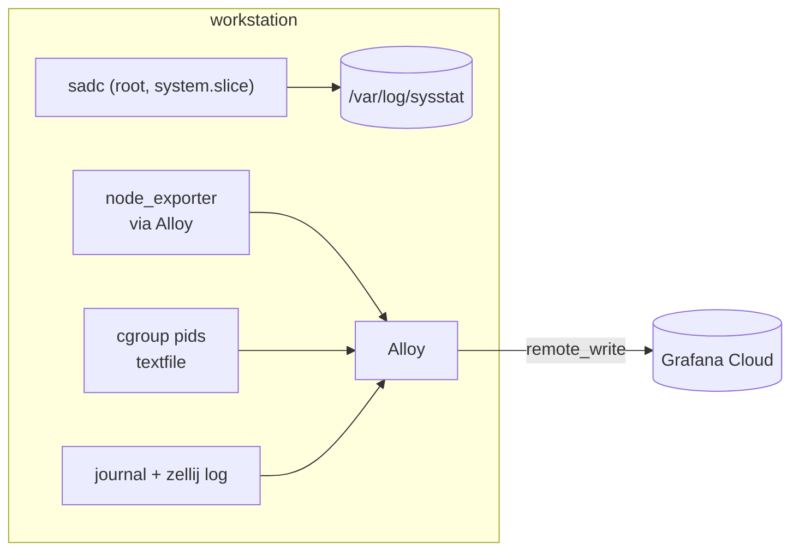

# Workstation telemetry

Why the workstation records what it does, and why it records it twice. To
operate it, see
[../how-to/viewing-workstation-telemetry.md](../how-to/viewing-workstation-telemetry.md);
for endpoints, paths, and metric names, see
[../reference/workstation-telemetry-reference.md](../reference/workstation-telemetry-reference.md).

## The problem

The workstation occasionally becomes unresponsive under heavy real use. The
failure is emergent under the full workflow at scale rather than reproducible
from a single isolated action, so it has to be caught in production rather than
staged.

That rules out most designs. Every user process shares one cgroup,
`user-1000.slice`, with a fixed pids ceiling. When that pool drains,
every fork in the slice fails with `EAGAIN`, including the fork a collector
needs to record the fact. A recorder inside the slice goes blind at the one
moment it matters.

## Two layers, chosen for what each survives

**sar** is the in-incident recorder. `sadc` runs as root in `system.slice`, so
it keeps sampling to local disk through a `user-1000.slice` pids exhaustion that
stops everything else. It samples every minute and keeps 28 days.

**Alloy** is the durability layer. Crostini can be reset wholesale, taking
`/var/log` with it, so a copy has to leave the box. It ships coarser data
(sar owns resolution) at a minute's interval to Grafana Cloud.

The split is deliberate: each layer captures something the other structurally
can't. sar survives the incident but not a container reset; Alloy survives the
reset but not the incident.

## No local stores

An earlier design ran Prometheus, Loki, Tempo and Grafana on the box. All four
have been removed. They duplicated what Grafana Cloud already holds, they cost
real capacity on a constrained machine, and every one of them ran in
`user-1000.slice`, so the stores went down with the same event as the
collectors. Redundancy that shares a failure mode isn't redundancy.

The rule applied: drop any measurement system that duplicates another, unless it
captures something lost precisely because the remote copy is unreachable. sar
passes that test. A local Prometheus doesn't.

## What the metrics are for

The interesting signals are the ones that describe fork pressure rather than
ordinary resource use: `node_forks_total`, `node_procs_running` and
`node_procs_blocked`, `node_processes_state`, and the cgroup pids pool itself.
The `processes` collector is off by default in node_exporter, and no packaged
collector emits cgroup pids accounting on cgroup v1 at all, so the pool is
published through a textfile the exporter picks up.
