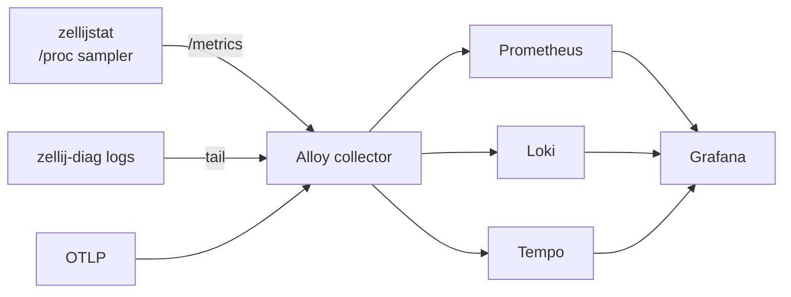

# Zellij-freeze observability

Background and rationale for the always-on telemetry stack that instruments
the Zellij-freeze investigation. To operate it, see
[../how-to/viewing-zellij-freeze-data.md](../how-to/viewing-zellij-freeze-data.md);
for ports, storage, and metric names, see
[../reference/zellij-freeze-observability-reference.md](../reference/zellij-freeze-observability-reference.md).

## The problem

Zellij becomes unresponsive under heavy real use, and the failure is emergent
under the full workflow at scale, not in a single isolated pipe. Anything
emitted from *inside* Zellij dies with it in a full deadlock, so the only thing
that can record up to and through the wedge is an external observer.

## The shape

`zellijstat` enumerates every Zellij server (a process whose `comm` is `zellij`
*and* whose arguments include `--server`, never a substring match that would
also catch the sampler's own shell) and samples each from `/proc`: threads by
name, per-thread wait-channel, Unix-socket connections and queue depths, file
descriptors, CPU, and memory. Reading `/proc` needs no privilege and never
touches the Zellij IPC socket, so the sampler keeps reporting straight through a
wedge.

## Storage is separate from the viewer

The capture services run as always-on systemd user services that write to local
disk. The store is independent of Grafana by design: the viewer can be down,
or never opened, without losing data, so capture never depends on someone
watching.

## Logs and traces are complementary, not redundant

Alloy also tails a diagnostics log directory (`$XDG_STATE_HOME/zellij-diag`)
into Loki and accepts OTLP into Tempo, so the stack covers all three signal
types. These come from instrumentation inside Zellij, which sees what the
external sampler structurally can't: the `/proc` view has thread, connection,
and resource state, but the internal connection and pipe lifecycle is only
visible from within the process.
