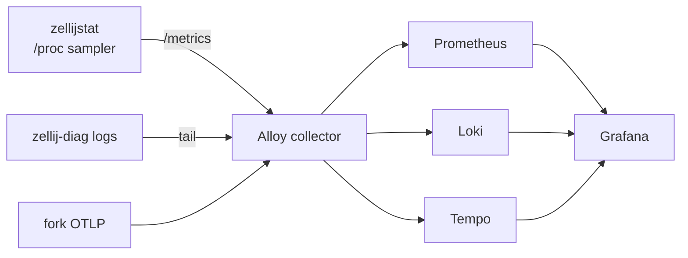

# Zellij-freeze observability stack

Background and rationale for the always-on telemetry stack that instruments
the Zellij-freeze investigation. To operate it, see
[../how-to/zellij-observability.md](../how-to/zellij-observability.md); for
ports, storage, and metric names, see
[../reference/zellij-observability.md](../reference/zellij-observability.md).

## The problem

Zellij becomes unresponsive under heavy real use, and the failure is emergent
under the full workflow at scale, not in a single isolated pipe. Anything
emitted from *inside* Zellij dies with it in a full deadlock, so the only
thing that can record up to and through the wedge is an external observer.

## The shape

`zellijstat` enumerates every Zellij server (a process whose `comm` is
`zellij` *and* whose arguments include `--server`, never a substring match
that would also catch the sampler's own shell) and samples each from `/proc`:
thread count by name, per-thread kernel wait-channel, Unix-socket connections
with their queue depths, file descriptors, CPU, and resident memory. Reading
`/proc` never touches the Zellij IPC socket, so the sampler keeps reporting
straight through a server wedge. It's a pull exporter: a scrape samples on
demand, so the resolution is the scraper's interval (Alloy at roughly two
seconds).

## Why the storage tier is native and always-on

The capture services (`zellijstat`, Alloy, Prometheus, Loki, Tempo) run as
always-on systemd user services that write to local disk continuously. The
storage backends being always-on is what makes capture durable: Grafana, the
viewer, can be down or never opened without losing data, because Prometheus,
Loki, and Tempo on the host keep recording regardless. An Alloy buffer alone
would not survive the viewer being absent: it's a forwarding queue, not a
store.

## Why metrics flow but logs and traces wait

Only the metrics path carries data today. `zellijstat` runs on stock Zellij,
so it collects immediately. The log path (`zellij-diag` files into Loki) and
the trace path (OTLP into Tempo) are wired but idle until the forks emit:
Zellij native OTEL (#223) and zellaude structured logs (#224). Wiring them now
means no re-plumbing when they land.

## Why loopback OTLP rather than a Unix socket

The OTLP receiver listens on loopback TCP (`4317`/`4318`) rather than a Unix
socket. Using loopback is equally local and carries no external-network
exposure, it's the documented Alloy configuration, and it matches the endpoint the
Zellij fork's OTLP exporter will target. None of these daemons support native
systemd socket activation, so a `.socket` unit would not help without a
`systemd-socket-proxyd` hop.
