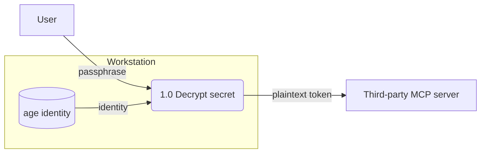

# DFD

References:

- <https://miro.com/diagramming/what-is-a-data-flow-diagram/> — components, levels, logical vs physical.
- <https://www.visual-paradigm.com/guide/data-flow-diagram/what-is-data-flow-diagram/> — drawing rules, balancing.

A DFD shows where data moves and what transforms it. Sequencing belongs
in a flowchart, object structure in UML; a DFD carries neither. Control
signals are not data — leave them out.

## Components

Four, and only four:

| Component | Is | Gane–Sarson | Yourdon/DeMarco | Mermaid |
| --- | --- | --- | --- | --- |
| External entity | A source or sink outside the system boundary | square | rectangle | `E[Name]` |
| Process | Work that transforms input data into output data | rounded rectangle | circle | `P(1.0 Verb the thing)` |
| Data store | Data at rest — a file, table, queue, keyring | open-ended rectangle | two parallel lines | `S[(Name)]` |
| Data flow | Named data moving between the above | labelled arrow | labelled arrow | `A -->\|data name\| B` |

Name every element. Entities and stores take noun phrases, processes
take verb phrases, flows take the name of the data itself
(`plaintext token`), never the mechanism carrying it.

## Levels

Four names, in order. Each level decomposes one process from the one
above it.

- **Context** — the whole system as a single process numbered `0`,
  surrounded by every external entity it exchanges data with. No data
  stores; internal storage is inside the system.
- **Level 0** — process `0` opened up into its major processes,
  numbered `1.0`, `2.0`, `3.0`. Data stores appear here first.
- **Level 1** — one Level 0 process opened up. Decomposing `2.0` gives
  `2.1`, `2.2`.
- **Level 2** — one Level 1 process opened up. Decomposing `2.1` gives
  `2.1.1`.

Stop at the level that answers the question asked, or at a process
whose decomposition would only restate it.

Pick logical or physical per diagram and hold it: a logical DFD names
business activities, a physical one names the software, hosts, and
files doing the work. Mixing them within one level is the usual reason
a DFD stops being readable.

## Rules

Drawing:

- Every process has at least one input flow and at least one output
  flow. Input only is a *black hole*, output only is a *miracle*, and
  outputs the inputs can't account for is a *grey hole*. All three are
  a missing flow or a wrong boundary.
- Data flows through a process. Store-to-store, entity-to-entity, and
  entity-to-store flows all need a process between them, because
  stores and entities are passive.
- Every flow has a labelled direction. A bidirectional arrow is two
  flows carrying two different pieces of data; draw both.

Balancing:

- A child diagram's inflows and outflows match its parent process's
  exactly — same set, same names. An extra or missing flow at the
  child is the defect balancing exists to catch.
- Flows internal to the decomposition are new at the child level and
  have no parent counterpart. Only boundary-crossing flows balance.
- Renaming a flow at one level renames it at every level it appears.

Currency:

- The diagram matches the system. Update it in the same change that
  adds, removes, or retunes an element it shows.

## Output

Mermaid `flowchart`, fenced inline in the markdown document. Renders on
GitHub with no export step and no tool to install. Classic node shapes
only — the `A@{ shape: ... }` extended syntax needs a Mermaid version
the renderer may not have.

Trust boundaries are an overlay, not a fifth component. Draw them on
DFDs for security work, where crossing one is the finding: one
`subgraph` per boundary, named for who or what controls that side.

## Location

A DFD explains a system, so it is a Diátaxis explanation — under
`docs/explanation/`, and the `diataxis` skill owns the surrounding
prose. Keep every level of one system's DFD in one file, each level
under its own heading, so balancing is checkable in a single read.

## Procedure

Draw:

1. Fix the system boundary — what is inside, which external entities
   exchange data with it, and, for security work, which trust
   boundaries the data crosses. Draw the context diagram.
2. Decompose to Level 0, then further only where the question needs it.
3. Name every element and every flow.

Check:

1. Walk *Rules* against the result, drawing rules first.
2. Balance each child diagram against its parent's flow set.
